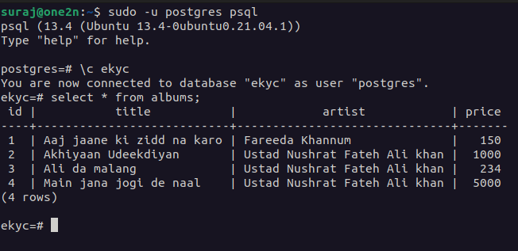
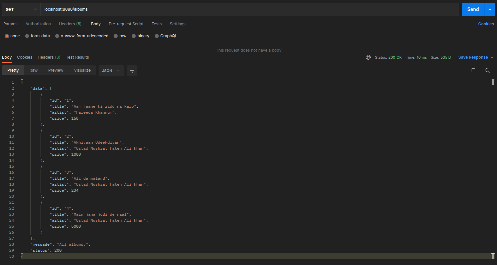
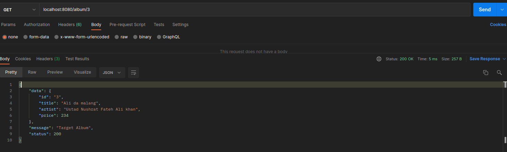
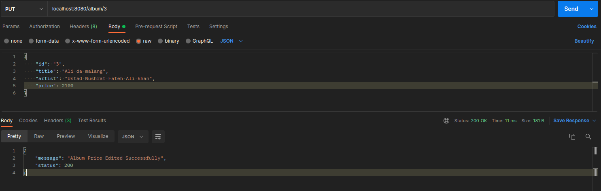
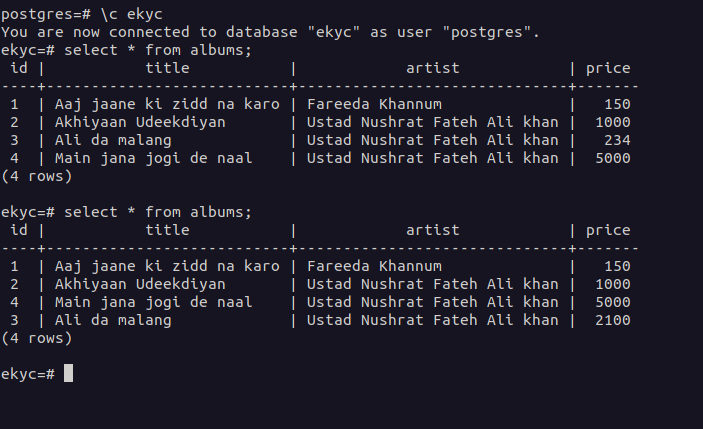
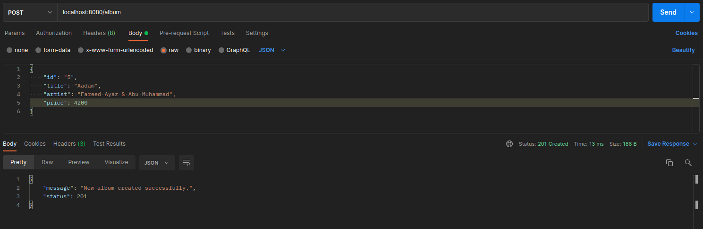
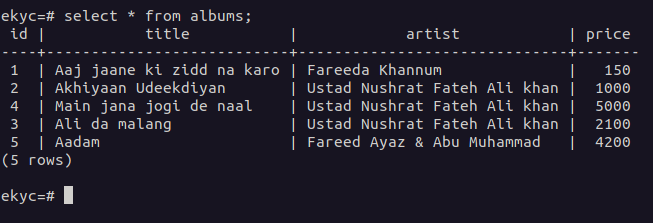
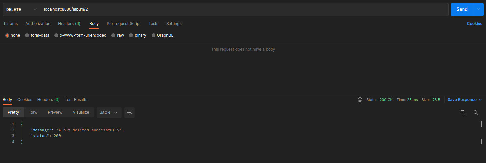
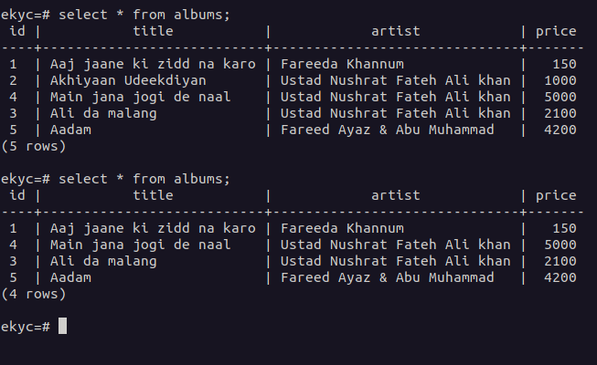

## Implementation as of 17.09.2021

### Initial state of the DB.

- i.e All data within the database.

1. Run the program using `go run main.go`
2. Use PostMan for the following operations.

## 1. Get all data within the database.

- [GET] localhost:8080/albums

## 2. Get a particular row of data using it's ID.

- [GET] localhost:8080/album/3

## 3. Edit the Price of the album using a PUT request.

- [PUT] localhost:8080/album/3

Here is the database after a successful PUT operation.

## 4. Adding a new row to the database using POST.

- [POST] localhost:8080/album

- Here is the Database after the POST operation

## 5. DELETE a row using it's ID.

- [DELETE] localhost:8080/album/2

- Database post Delete Operation
